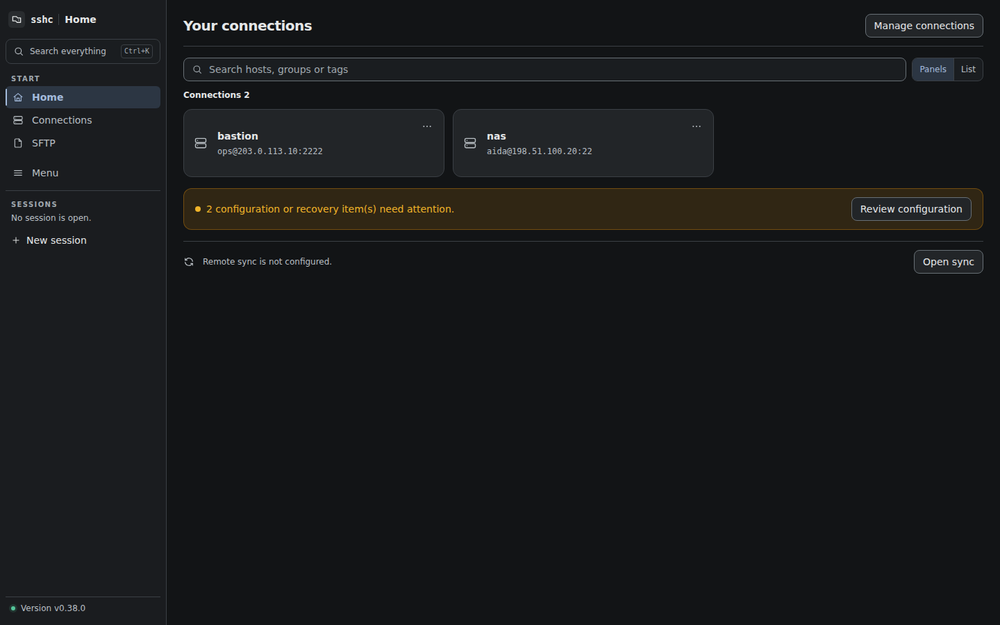

# sshc

OpenSSHの設定を正本のまま使う、local-firstなSSH workspaceです。接続管理、Terminal、SFTP、Workspace、Snippet、暗号化同期を一つのUIとCLIから扱います。

[日本語ドキュメント](https://aida0710.github.io/sshc/) · [English documentation](https://aida0710.github.io/sshc/en/) · [Releases](https://github.com/aida0710/sshc/releases)

[](https://aida0710.github.io/sshc/)

## インストール

macOS / Linux:

[Homebrew](https://brew.sh/)を未導入の場合は、公式サイトの手順でインストールします。

```sh
brew install aida0710/tap/sshc
```

Homebrewを使わない場合は、installerとbinaryを同じReleaseへ固定します。

```sh
SSHC_VERSION=v0.27.2 sh -c \
  'curl -fsSL https://raw.githubusercontent.com/aida0710/sshc/v0.27.2/install.sh | sh'
```

Windows PowerShell:

```powershell
powershell -NoProfile -ExecutionPolicy Bypass -Command "irm https://github.com/aida0710/sshc/releases/latest/download/install.ps1 | iex"
```

Android APKと各OS向けbinaryは[GitHub Releases](https://github.com/aida0710/sshc/releases)から取得できます。詳しい検証方法と更新手順は[インストールガイド](https://aida0710.github.io/sshc/guide/install)を参照してください。

## 起動

```sh
sshc engine
sshc
```

`sshc engine`はforegroundで動き、デーモン化しません。引数なしの `sshc` はエンジンを起動しません。自動起動は OS のプロセス管理機能で設定します。Linuxでは`sshc service install`でsystemdユーザーサービス、macOSではlaunchdユーザーエージェントへ登録できます。その他の環境ではtmuxなどを利用できます。

初回はWeb UIまたはCLIでvaultを作成し、開きます。

```sh
sshc vault create
sshc vault unlock
```

master passwordはWeb UI または `sshc vault`から入力します。CLI は対話端末からのみ読み取り、引数や環境変数からは受け取りません。vaultは既定では12 時間操作がない場合に自動lockし、Settingsで1〜999分／時間または自動lockなしへ変更できます。

## CLIの入口

```sh
sshc ssh                     # 接続先を選択
sshc ssh <接続先>            # 対話SSH
sshc ssh <接続先> --non-interactive -- <コマンド>
sshc info <接続先> --json    # engineなしで実効設定を表示
sshc status --json           # engineの状態
sshc sync                    # 同期状態
sshc sftp get <接続先> /remote/file ./local-file
sshc sftp put <接続先> ./local-file /remote/file
sshc help                    # 全command
```

## 主な機能

- OpenSSHのコメント、順序、空白、`Include`を保った設定管理
- 接続状態、検索、再接続、文字コード、Quick Commandsを備えたTerminal
- folder転送、resume、background queue、editorを備えたSFTP
- SSHとlocal shellを最大4 paneに分割するWorkspace
- host、file、Snippet、設定を横断するCommand Palette
- S3互換storageへの暗号化snapshot同期
- SSH、SFTP、Serial、Telnet、同期、Terminal操作のCLI

機能と安全上の境界は[利用者向けドキュメント](https://aida0710.github.io/sshc/)へ集約しています。内部設計は[docs/design.md](docs/design.md)を参照してください。

## 開発

Go 1.26とNode.js 22が必要です。

```sh
make build
make test
make e2e
make integration-up
make integration
make integration-down
```

Web UI変更時は`internal/ui/dist`も更新します。利用者向けsiteは`pages/`にあり、`npm run build`で検証できます。

## License

[Apache License 2.0](LICENSE)
